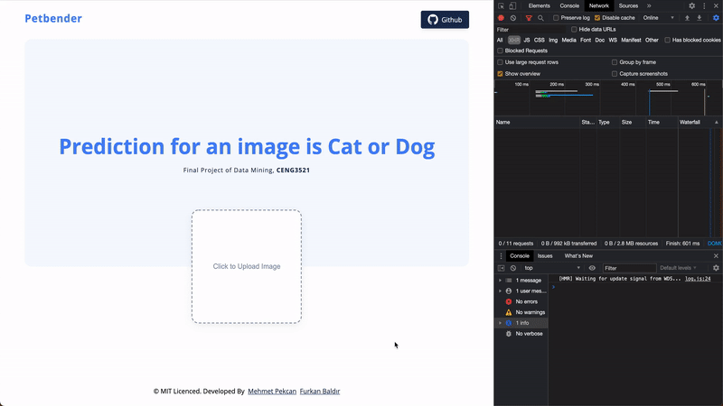

## Description

Live example is: `https://supremepanda.github.io/CatsVsDogs`

Api runs at: `https://client-cats-vs-dogs.herokuapp.com/`

The main goal of the project is that predicting the given image is cat or dog.

## To run in Local

To run our example local. There are two main things to do. First running the Flask Api then running the
React web server. To do that first be sure Node.js is installed in your computer.

If not <a href="https://nodejs.org/en" target="_blank">click to download</a>.

Then, in project folder, run
`npm install`

after install the whole node packages, run
`npm run start-flask`

That will run the Flask Api server.
After ran API serevr succesfully, run
`npm run start`

## Team & Roles

All contribituions is made together so than there is no meaning to split our code base as a roles or team.
But if we have to split our code base roles, they are mostly like that;

**Frontend:** Mehmet Pekcan

**Backend:** Furkan Baldır

**DevOps:** Mehmet Pekcan

**Api:** Mehmet Pekcan

## Structure:

Mainly three base folder structure.
Backend folder for declaring image class based on previous data set training model.
Rest of the files represent Frontend that is serving project that have high user experience and efficient way.
Api folder for communicating between frontend and backend.

## Language

### Python

Flask_Cors 3.0.10: To make request to api without crossorigin problem.  
Flask 1.1.2: To create and deploy an API.  
Numpy 1.19.5 To convert image to mathematical array.
Pillow 8.1.0 To open and to manipulate images.
Scikit_learn 0.24.1 To using Support Vector Machine algorithm.

## Javascript

React: To build Progrssive Web App
Redux: To handle app data on central place  
Redux Saga: To handle asynchronous actions like API request
Redux Sauce: To handle better and understandable with Saga pattern  
Reselect: To handle data without side effects
Styled Components: To handle styles better maintainable way when app grows
Immer: To handle saving data to Redux more clear way

Entry file for backend is backend/predict.py.
Entry file for frontend web application is

## Additional:

Main goal of this project is that only making `*.py` for showing the project. But to make better user experience we made a Progressive Web App.
